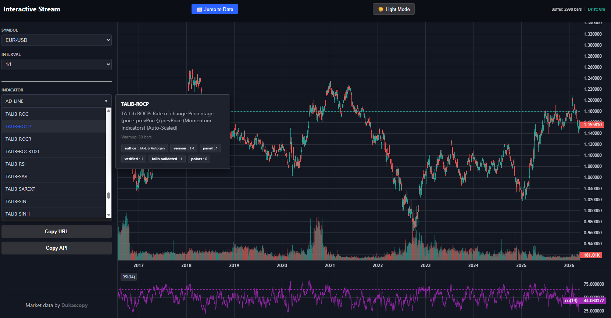

This is a stripped-down version of the original project. The original project is being refactored to a general purpose library. This current state is shared in order to support HMOE2 (other project) for certain users.

Python 3.9+

## What Is This Tool Used For?

Ingest is a high-performance, local-first data bridge built for indie traders. Unlike cloud-based solutions, it is optimized for zero-latency local execution, allowing your trading terminal and data API to run side by side without resource contention. \
\
The system incrementally updates market data, resampling completed 1-minute candles into a set of default higher timeframes that can be customized globally or per symbol. It also tracks open higher-timeframe candles, which can optionally be excluded through modifiers. \
\
Data can be queried or constructed directly from a WSL2 terminal or via an HTTP API service. Designed by a trader, for traders, BP-Markets focuses on performance, accuracy, and workflow efficiency. Future releases will introduce high-performance backtesting capabilities that fully eliminate lookahead bias. \
\
The tool features a customizable, advanced (hybrid) indicator engine and uses an internal API to query data across assets and timeframes, including access to indicator values from other instruments. Indicators can be expressed as Polars-expressions or implemented on Pandas dataframes directly. \
\
Any modern laptop having NVMe will do. Storage requirements are about 1 GB per configured symbol. \
\
The code-base is small and heavily documented. This is a high-performance system. One of the project's goals is to "checkout" how far performance can be pushed with a developer-friendly language like Python. Every part of the system is regularly profiled to identify performance bottlenecks. \
\
Note: This is not a click-and-go or “magical” project. It’s intended for data preparation to support downstream analysis, such as machine learning. You can use it to test and design indicators or to extract inter-asset features for ML workflows—that’s how I use it. While indicator-integrated data can be extracted, that is not the primary purpose of this project. You will need to know Python if you want to use this project efficiently. 

Example chart:



>http://localhost:8000/index.html

Example manifold studio (visualizer for deep-learning purposes):


>http://localhost:8000/studio.html

(Studio will get updated with latent space analysis. Studio is part of the research on timely trendshift detection using Hmoe. It is in final testing phase. Will not only look great but also be very useful)

Historical market data can be leveraged in multiple ways to enhance analysis, decision-making, and trading performance:

- **Backtesting** → Evaluate and refine trading strategies by simulating them on past market conditions. This helps determine whether a strategy is robust, profitable, and resilient across different market environments.

- **Technical Analysis** → Use historical charts to identify trends, chart patterns, support- and resistance levels. You can also perform correlation studies to compare long-term relationships between currency pairs or other assets.

- **Seasonal Analysis** → Detect recurring market behaviors or unusual pricing patterns that tend to appear during specific months, weeks, or seasons.

- **Volatility Assessment** → Analyze historical volatility to adjust risk parameters, optimize position sizing, and set more accurate stop-loss levels.

- **Computational Intelligence** → Build machine-learning or statistical models trained on historical price data to forecast potential market movements.

- **Economic Event Impact** → Study how past economic releases, geopolitical events, and news shocks influenced currency pairs — helping you prepare for similar situations in the future.

---

## Server Kindness

[Dukascopy SA](https://www.dukascopy.com) has been providing this priceless data **for free since 2003** with no paywall and no API key. This entire pipeline only exists because of their generosity.

If you find this tool useful, please consider:

- Trying their platform (I’ve been a happy client for years — support is actually human and fast)
- Running the script no more than once per hour unless you truly need minute-level updates

These two small acts keep the data flowing for everyone, forever.
Thank you — and thank you, Dukascopy.

---

## Quick start

Clone the repository

```
git clone https://github.com/jpueberbach4/ingest.git
cd ingest/dukascopy
```

Make sure python version is 3.9+. 

```sh
python3 --version
```

Install dependencies with:

```sh
./setup-dukascopy.sh
```
---

Configure your symbols as shown in the next section of this readme.

>[Symbols Configuration](#symbols-configuration)

Next, run the pipeline with:

```sh
./rebuild-full.sh
```

Optionally, configure a cronjob for periodical execution: 

```sh
crontab -e
```

Add the following line, adjust path accordingly-run once every 15m:

```sh
*/15 * * * * sleep $(( (RANDOM \% 17) + 10 )) && cd /home/jpueberb/repos2/bp.markets.ingest/dukascopy && ./run.sh
```

---

## Symbols Configuration

This project includes a symbols.txt file, which is a single-column CSV containing symbol identifiers.
If you wish to override this default list of symbols

```sh
cp symbols.txt symbols.user.txt
```

Next edit symbols.user.txt to include your symbols of interest (symbols.user.txt is in .gitignore). 

**Important:** If you are using this for "live-edge" as well, you should add BTC/USD to the symbols.user.txt. This symbol is the heartbeat symbol for the system. It allows you to detect open-candles at the live-edge correctly. See the [indicators.md](docs/indicators.md), mid- to bottom section on how to build indicators that discard open-candles (requirement for live-edge).

---

All symbols supported by the Dukascopy API are available, with no restrictions. 

Please see here for a complete symbol list:

[Dukascopy historical download](https://www.dukascopy.com/swiss/english/marketwatch/historical/)

You can just copy the literal symbol-name to your symbol.user.txt.

We stop our crontab service for a moment or comment the line for `run.sh` in crontab. Next, we add the symbol as a new row in symbols.user.txt. Next, run the pipeline using:

The pipeline will begin downloading the symbol's historical data (this may take some time) and then execute the remaining steps.

The new symbol is now added and will be updated automatically during each incremental run.

>When you don't stop the crontab periodic execution before changing the symbol list, you will need to ```rebuild-full.sh```!

---

## Quick check

For users who are just getting started, or for those who want a quick way to validate their generated data:


Start your localized HTTP API service

```sh
./service.sh start
```

Now open in a browser:

```sh
http://localhost:8000
```

It will show you your localized data.

---

## Terms of Use

- Data originates from Dukascopy Bank SA ([www.dukascopy.com](https://live-login.dukascopy.com/rto3/))
- You must respect [Dukascopy's Terms of Service](https://www.dukascopy.com/swiss/english/legal-pages/terms-of-use/)

---

## License

This software is licensed under the MIT License.


